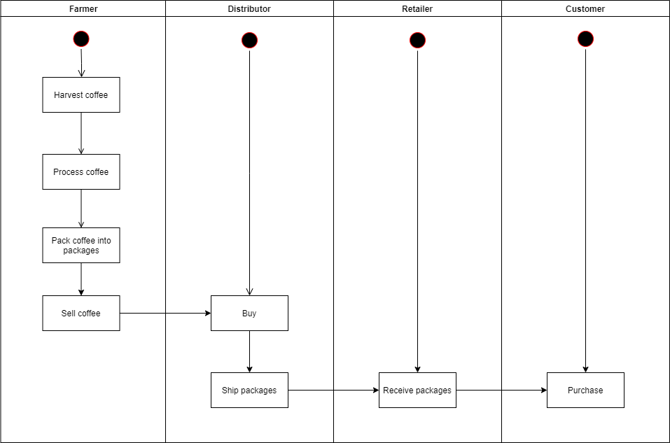
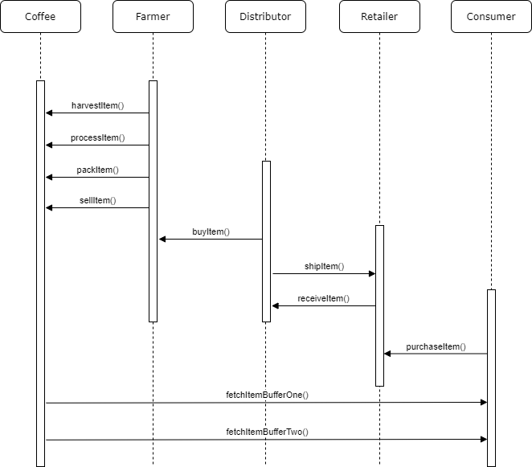
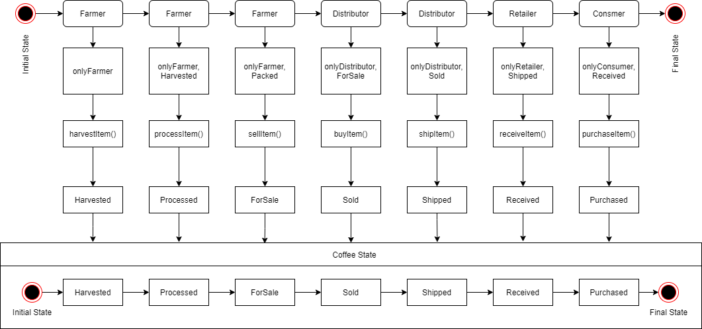
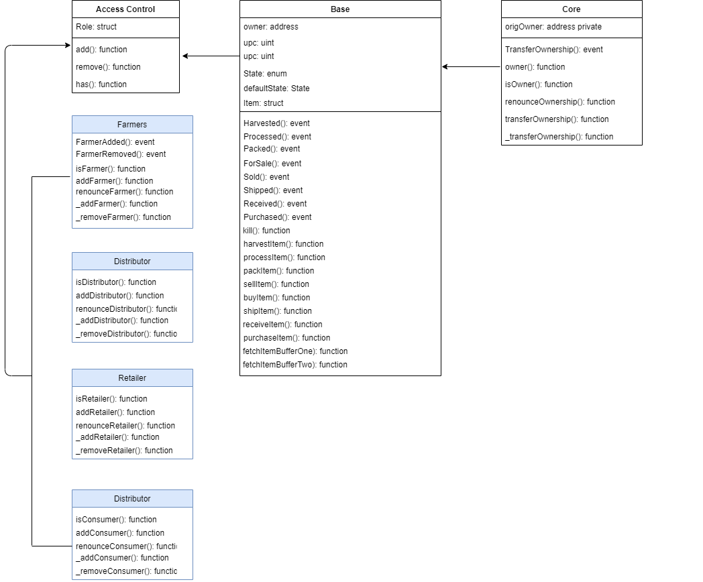

# Ethereum Dapp for Tracking Items through Supply Chain

## Libraries
I used the `Roles` library to provide add and remove functions to different access control contracts in the supply chain, `truffle-hd-wallet-provider` to sign transactions for addresses, and `truffle-assertions` to track events as `.watch()` syntax is deprecated in web3 v1.2.1.

## IPFS
IPFS was not used in this project.

## Versions
* Program version number v1.0
* node v10.16.3
* truffle v5.1.12
* truffle-hdwallet-provider v6.9.0
* truffle-assertions v0.9.2
* web3 v1.2.1

## Contract address
| Contract        | Contract Address                                                                   |
| --------------- | :--------------------------------------------------------------------------------  |
| SupplyChain     | https://rinkeby.etherscan.io/address/0x02316b70ad0be0e695030022b99e473adf26ba96    | 
| ConsumerRole    | https://rinkeby.etherscan.io/address/0x385c5969652cdd81be3ea626e79e6523008a8f48    | 
| DistributorRole | https://rinkeby.etherscan.io/address/0xb133cb40b4fa81ba345f03c302a96ec5d7e14f10    |
| FarmerRole      | https://rinkeby.etherscan.io/address/0x0f9df06caf0ba6d8cf2ffa8cdfcab3bd4edf72d9    |
| RetailerRole    | https://rinkeby.etherscan.io/address/0x9a7f0d81641008d8115be4f40322e02590b7ed82    |

## Diagrams
### Activity diagram

### Sequence diagram

### State diagram

### Class diagram

